

# Introduction au Machine Learning

---

## Présentation

- Le machine learning ???
- Comment ça marche ?
- La mise en oeuvre
- Quelques modèles

---

## Le machine learning ???

---

### Vocabulaire

- artificial intelligence (AI)
- machine learning (ML)
- deep learning (DL)

<!-- IA > ML > DL > generative models -->
<!-- AGI vs ANI vs ASI -->
<!-- modèles génératifs -->
---

### Définition

Le but du ML est de __prendre des décisions__ ou __faire des prédictions__ en se basant sur les __données__.

<!-- prendre des décisions = faire une classification -->
<!-- en se basant sur les données -> en "apprenant" -->
<!-- en économie et en psychologie, on cherche à trouver des modèles des processus sous-jacents -->
<!-- en statistique, on cherche un modèle qui correspond aux données -->

---

Les __données__ sont __primordiales__.

---

#### Prendre des décisions

<!-- le commentaire est-il positif ou négatif ? -->
<!-- la transaction est-elle frauduleuse ? -->
<!-- qui essaye de déverrouiller le téléphone ? -->
<!-- dois-je tourner à gauche, à droite, accélérer, freiner ? -->

---

#### Faire des prédictions

<!-- est-ce qu'il va pleuvoir dans l'heure ? -->
<!-- quel produit va aimer tel utilisateur ? -->

---
### Applications

- La recommandation de musique
- Le filtrage des mails
- Les feeds sur les réseaux sociaux
- Les assistants vocaux
- Les assistants type ChatGPT
- Les voitures autonomes
- ...

---

### Les principaux types

- apprentissage supervisé
- apprentissage non-supervisé
- apprentissage par renforcement

---

#### L'apprentissage supervisé

Trouver une fonction $f(X)$ telle que:

$$f(X) = Y$$

avec $X$ : les exemples
avec $Y$ : les étiquettes

<!-- modèles de classification ou de regression (avec Y dans les réels) -->
<!-- on connait les classes Y (étiquettes), on connait également les exemples X (caractéristiques) -->

---

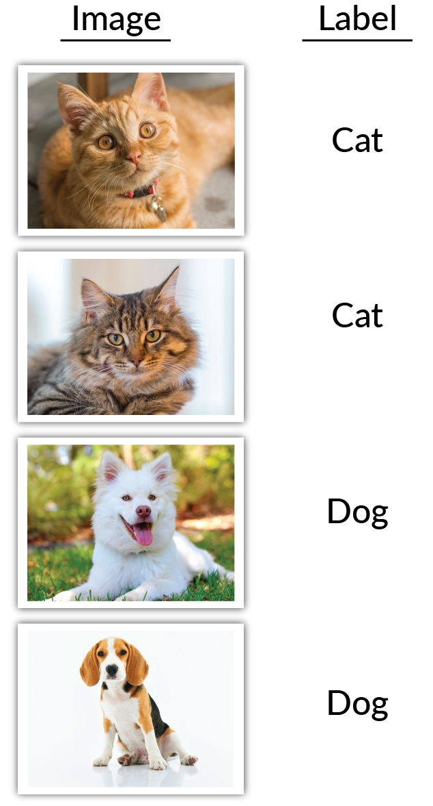

---

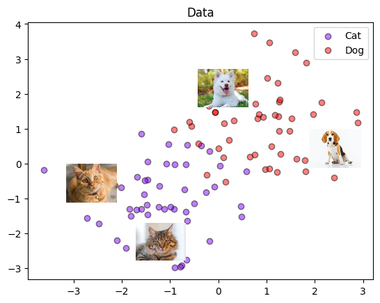

---

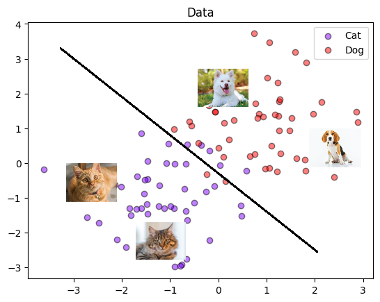

---

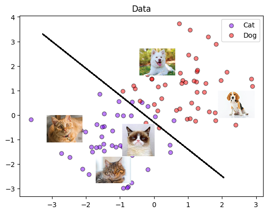

---

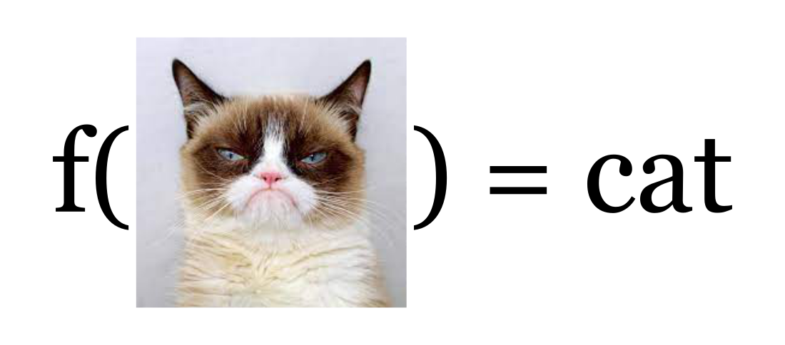

---

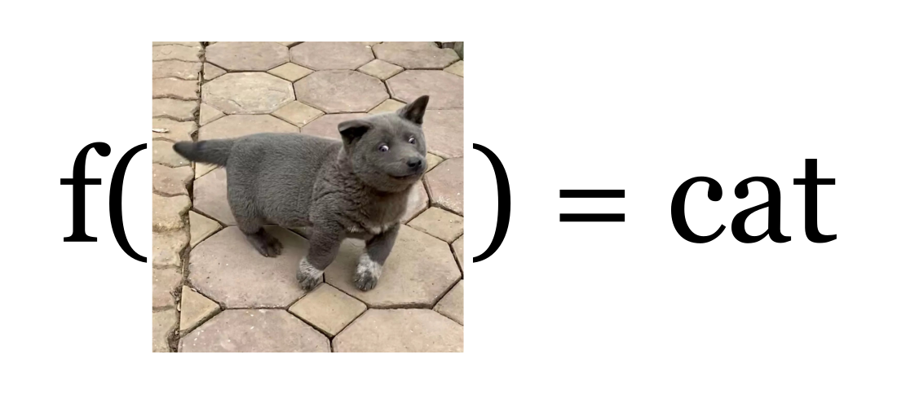

---

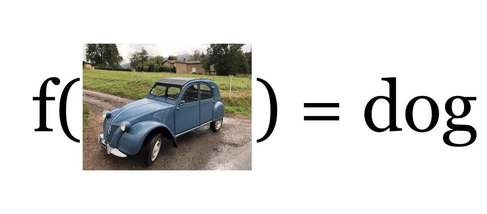

---

#### L'apprentissage non-supervisé

Trouver des patterns ou des structures cachés dans des données.

<!-- faire de la réduction de dimensions -->
<!-- identifier des groupes dans un ensemble d'utilisateurs (clustering) -->
<!-- détection d'anomalies -->

---

---

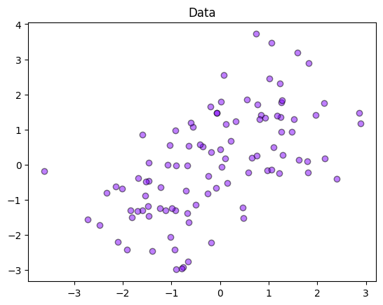

---

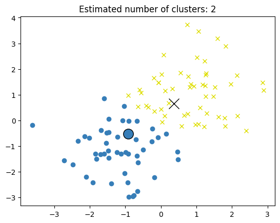

---

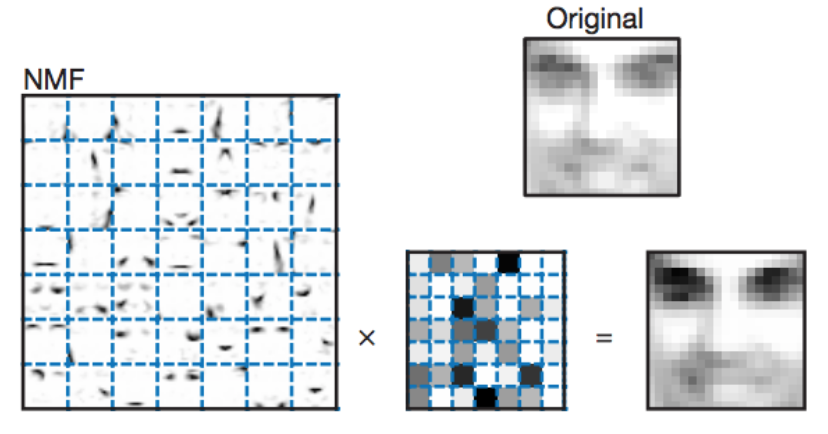

---

#### L'apprentissage par renforcement

Faire évoluer un agent dans un environnement afin qu'il apprenne à réaliser des actions qui le récompensent.

<!-- robot qui doit apprendre à marcher -->
<!-- IA qui joue à Mario -->

---

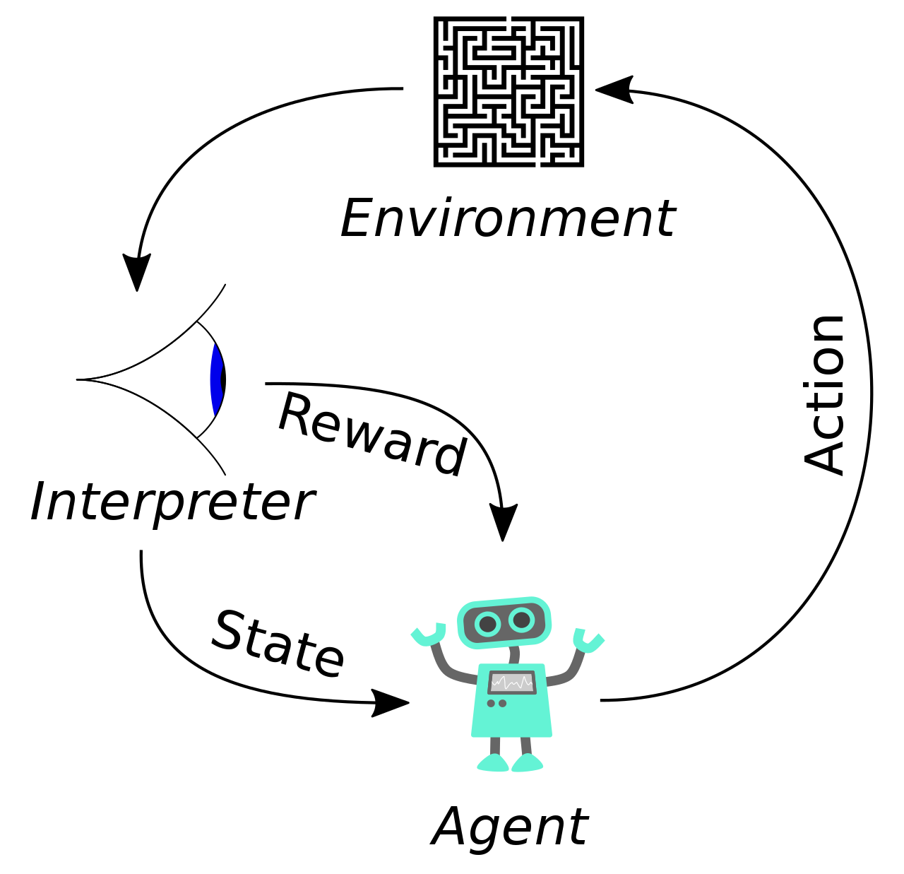

---

---

---

## Comment ça marche ?

---

### L'entrainement d'un modèle

0. On initialise un modèle
1. On utilise le modèle pour faire une prédiction
2. On compare la prédiction à ce qu'on attend
3. On corrige le modèle
4. On recommence à partir de 1 jusqu'à être satisfait

---

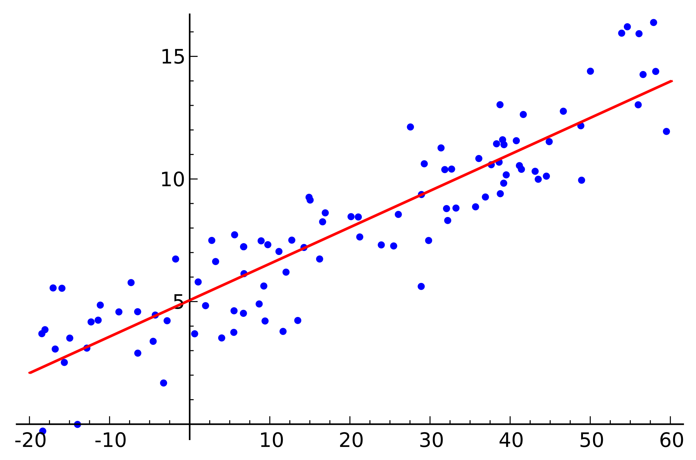

<!-- erreur = somme des carrés des résidus -->

---

### Définir un critère d'évaluation de l'erreur

- Distance L1, L2
- Précision, rappel, score F1
- Distance de Levenshtein
- ...

<!-- La distance de Levenshtein est une distance, au sens mathématique du terme, donnant une mesure de la différence entre deux chaînes de caractères. Elle est égale au nombre minimal de caractères qu'il faut supprimer, insérer ou remplacer pour passer d'une chaîne à l'autre. -->
<!-- L(chien, chat) = 3 -->

<!-- distance euclidienne (à vol d'oiseau) -->
<!-- distance de manhattan -->

---

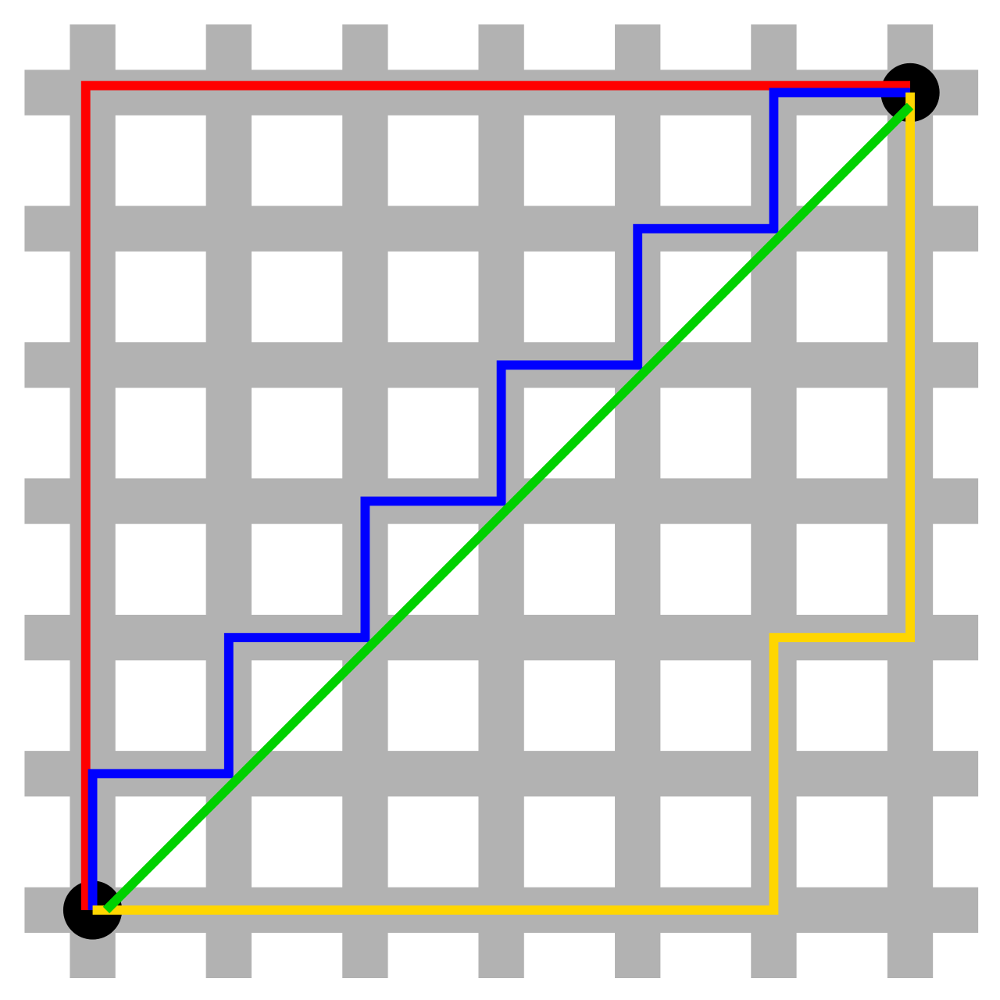

---

### Éviter le sous-apprentissage et le sur-apprentissage

Un modèle de ML doit être capable d'__estimer__ et de __généraliser__.

<!-- la séparation en plusieurs ensembles : train, validation, test -->

---

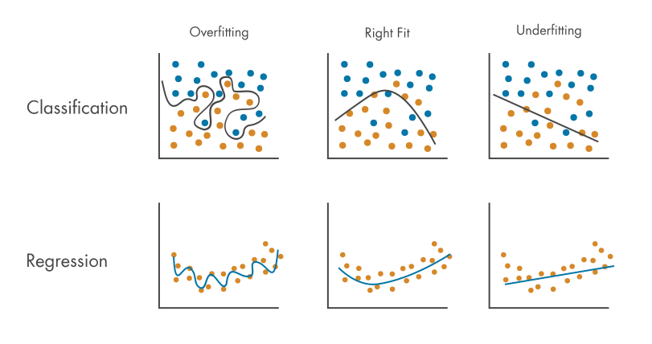

---

### La mise en oeuvre

---

<!-- http://nirvacana.com/thoughts/2013/07/08/becoming-a-data-scientist/ -->

---

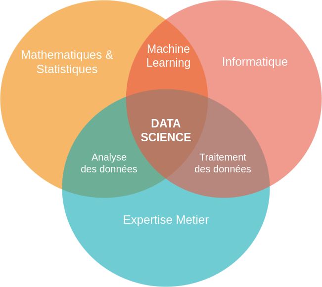

---

#### Cadrer le problème

- identifier le type du problème
- poser des hypothèses sur les données
- choisir un critère d'évaluation
- choisir un modèle
- choisir un algorithme pour l'apprentissage
- choisir un algorithme pour l'inférence

<!-- nettoyer les données -->
<!-- arbre de décision, forêt aléatoire, régression logistique, réseau de neurone, SVM, K-plus-proches-voisins -->

---

## Quelques modèles

<!-- https://scikit-learn.org/stable/auto_examples/classification/plot_classifier_comparison.html#sphx-glr-auto-examples-classification-plot-classifier-comparison-py -->

---

### Les arbres de décision

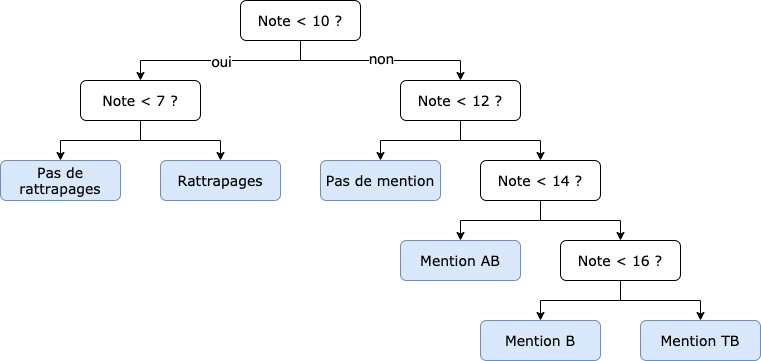

---

### Les forêts aléatoires

Un ensemble d'arbres de décision

---

### Les réseaux de neurones

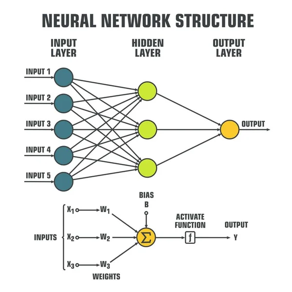

---

### Les KNN

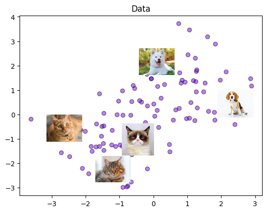

---

## Conclusion

Le Machine Learning vise à faire des prédictions ou prendre des décisions en se basant sur des données.

Il faut :
- identifier le type du problème
- comprendre les données

---

## Ressources pour aller plus loin :

- https://fr.wikipedia.org/wiki/Apprentissage_automatique
- https://scikit-learn.org/stable/user_guide.html

- cours en accès libre :
  - ⭐ https://www.kaggle.com/learn
  - https://www.coursera.org/specializations/machine-learning-introduction
  - https://openlearninglibrary.mit.edu/courses/course-v1:MITx+6.036+1T2019/courseware/Week1/intro_ml
